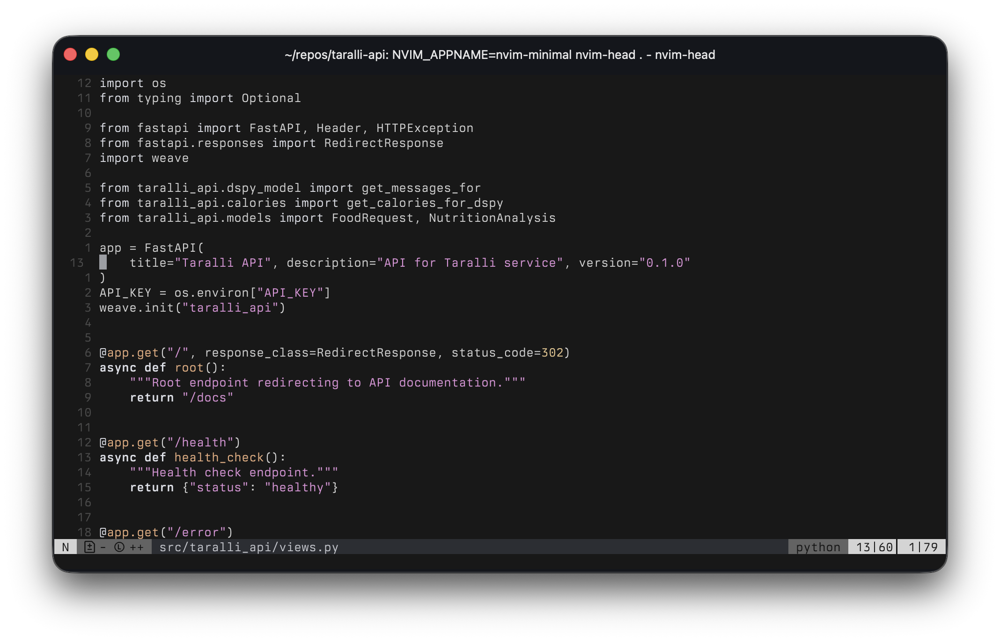
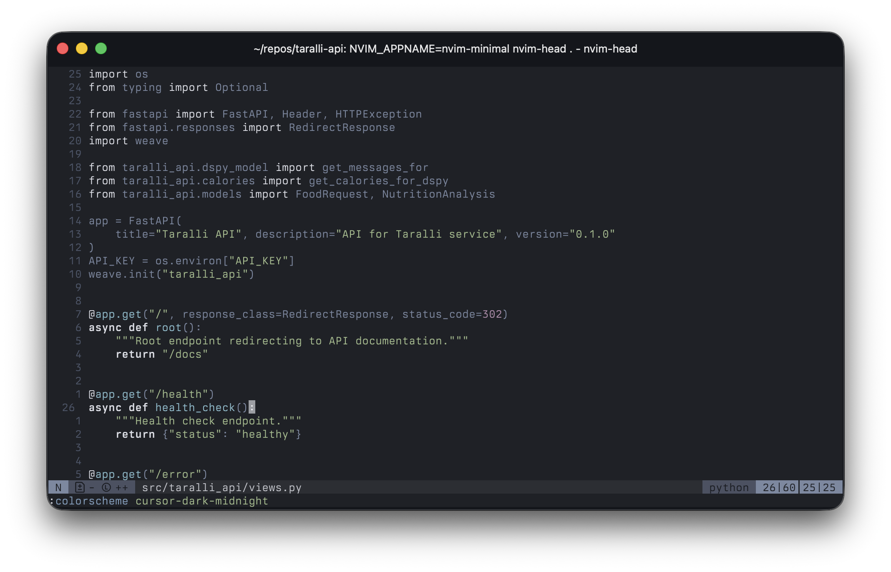
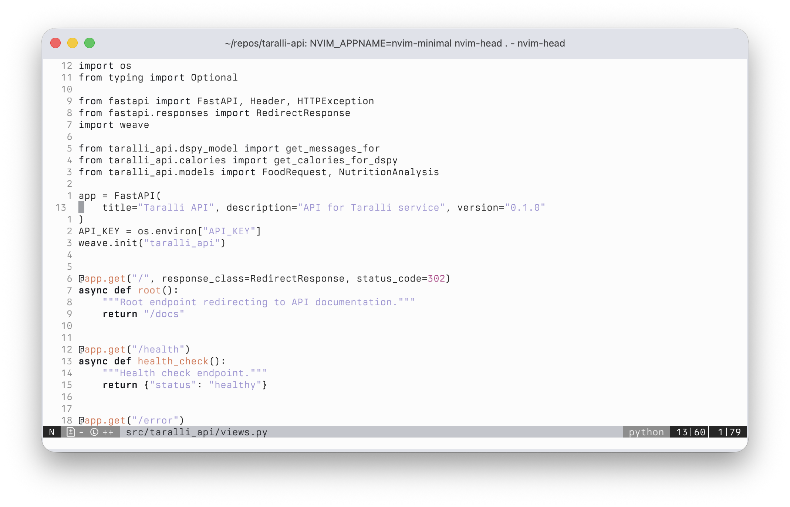

# Cursor Themes for Neovim

Stole [these](https://github.com/BioHazard786/cursor-theme-vscode) themes and converted them to Neovim colorschemes using [djanho](https://github.com/viniciusmuller/djanho).


## Themes

### cursor-dark
Dark theme with vibrant colors



### cursor-dark-midnight
Darker midnight theme with Nord-inspired colors



### cursor-light
Light theme with high contrast



## Installation

### Using [lazy.nvim](https://github.com/folke/lazy.nvim)

```lua
{
  'duarteocarmo/cursor-themes.nvim',
  lazy = false,
  priority = 1000,
}
```

### Using [packer.nvim](https://github.com/wbthomason/packer.nvim)

```lua
use 'duarteocarmo/cursor-themes.nvim'
```

### Using vim-plug

```vim
Plug 'duarteocarmo/cursor-themes.nvim'
```

## Usage

Set the colorscheme in your Neovim configuration:

```lua
vim.cmd.colorscheme('cursor-dark')
-- or
vim.cmd.colorscheme('cursor-dark-midnight')
-- or
vim.cmd.colorscheme('cursor-light')
```

Or in Vimscript:

```vim
colorscheme cursor-dark
```

## License

MIT
