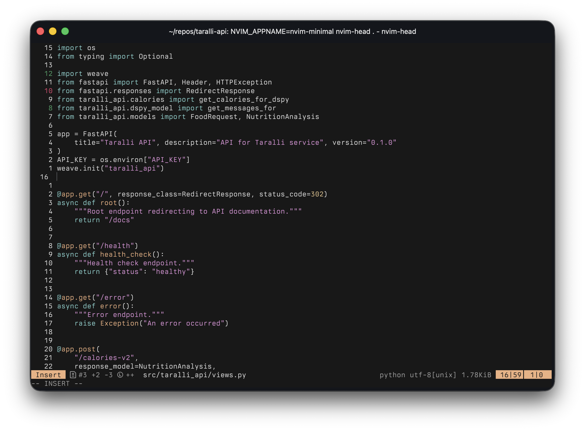
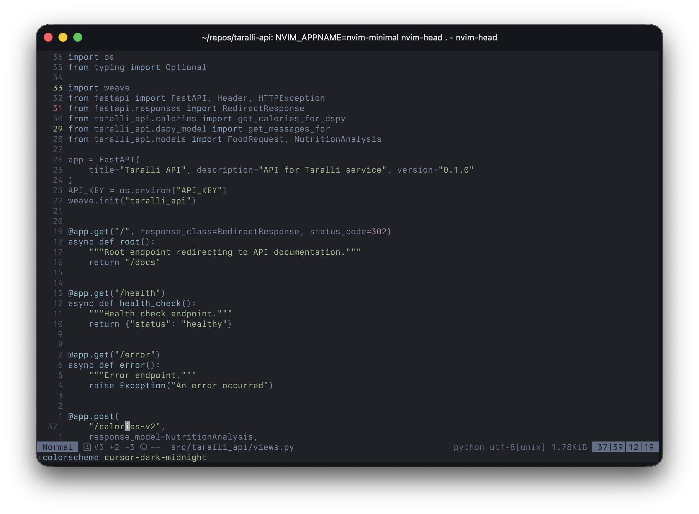
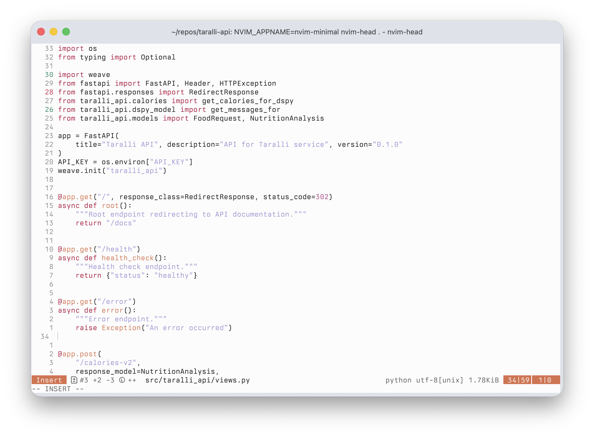

# Cursor Themes for Neovim

Modern Neovim colorschemes inspired by [Cursor](https://cursor.com/). 

## Themes

### cursor-dark


### cursor-dark-midnight


### cursor-light


## Installation

### Using [lazy.nvim](https://github.com/folke/lazy.nvim)

```lua
{
  'duarteocarmo/cursor-themes.nvim',
  lazy = false,
  priority = 1000,
}
```
You can also use any other plugin manager - it should work.

## Usage

Set the colorscheme in your Neovim configuration:

```lua
vim.cmd.colorscheme('cursor-dark')
-- or
vim.cmd.colorscheme('cursor-dark-midnight')
-- or
vim.cmd.colorscheme('cursor-light')
```

## License

MIT
